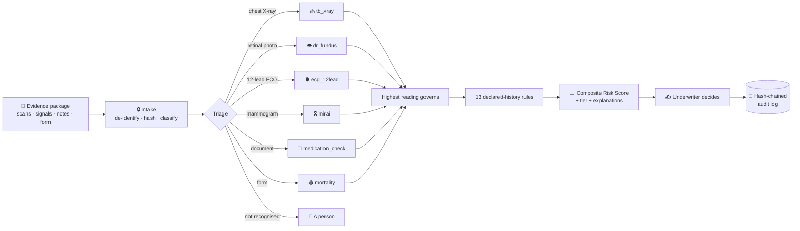

<div align="center">


# HomelanderAI

**AI decision support for life, health and critical-illness underwriting.**

Six specialised model arms read an applicant's medical evidence, return one Composite Risk Score with the reasons behind it, and hand the decision to a licensed underwriter.<br/>
Every output is a recommendation. Nothing is ever denied automatically.

<br/>

[](apps/api/pyproject.toml)
[](apps/api)
[](apps/web)
[](apps/web)
[](db/schema.sql)
[](apps/api/app/arms)
[](apps/api/tests)
[](#-disclaimer)

[Quick start](#-quick-start) · [How it works](#-how-it-works) · [Model arms](#-model-arms) · [The console](#-the-console) · [Documentation](#-documentation)

</div>

<br/>

## 📌 Overview

Underwriters face **early-claim asymmetry**. An applicant can carry early-stage, asymptomatic pathology that passes a health questionnaire and a nurse screening, be written at baseline rates, and file a catastrophic critical-illness claim months later.

HomelanderAI surfaces findings associated with elevated near-term risk from evidence the carrier already collects. An operator enters the applicant, attaches the scans, signals and notes they brought, and submits. The platform de-identifies the files, routes each one to the model that can read it, fuses the readings with the declared history, and queues the result. One to two business days later an underwriter opens it, sees the score, the heatmaps and the factors that moved it, and records the decision under their own name.

It is a **multi-tenant B2B platform**: each carrier sees only its own applications, sets its own tier boundaries and pricing, and manages its own staff.

<br/>

## 🔢 By the numbers

<table align="center">
  <tr>
    <td align="center" width="25%"><h2>6</h2><sub>model arms across imaging,<br/>signals, text and lab values</sub></td>
    <td align="center" width="25%"><h2>5</h2><sub>evidence types read,<br/>plus the intake form itself</sub></td>
    <td align="center" width="25%"><h2>13</h2><sub>declared-history rules<br/>the image cannot know</sub></td>
    <td align="center" width="25%"><h2>0</h2><sub>automated denials,<br/>asserted in tests</sub></td>
  </tr>
  <tr>
    <td align="center"><h2>366</h2><sub>automated tests</sub></td>
    <td align="center"><h2>32</h2><sub>API endpoints</sub></td>
    <td align="center"><h2>15</h2><sub>tables, row-level security<br/>on every tenant table</sub></td>
    <td align="center"><h2>3</h2><sub>staff roles, each with<br/>a built-in demo account</sub></td>
  </tr>
</table>

<br/>

## ⚙️ How it works



1. **Intake discards the original.** A DICOM is rendered to PNG and thrown away. A tag that is never stored cannot leak.
2. **Triage abstains rather than guesses.** A file it cannot identify goes to a person, because a retina model handed a chest X-ray returns a confident 98.8 with no error.
3. **Every arm declares what it accepts.** Even if routing is wrong, the arm refuses instead of inventing a number.
4. **The highest reading governs.** A concerning finding on one film is never averaged away by a clean one.
5. **Declared history adjusts the score.** Previously treated tuberculosis with no symptoms lowers it. The same history with a current cough raises it.
6. **A missing score is not zero.** It sends the application to *insufficient evidence*, never to *low risk*.
7. **A person decides, once.** The decision is write-once, attributed, and there is no reject button.

<br/>

## 🧠 Model arms

Published models, used as published. Where we trained anything, it is a thin head over a frozen backbone, exported to plain JSON so runtime scoring needs no ML library. Every score carries its arm's validation statement to the screen, so the caveat cannot be left behind in a document.

| | Arm | Reads | Screens for | Method | Headline result |
|:-:|---|---|---|---|---|
| 🫁 | **Chest X-ray**<br/>`tb_xray` | Chest radiograph<br/>DICOM · PNG · JPEG | Tuberculosis | TorchXRayVision DenseNet-121 → 18 findings → logistic regression trained on Shenzhen (662 images) | **AUC 0.877** ± 0.037<br/>5-fold CV, internal only |
| 👁️ | **Retina**<br/>`dr_fundus` | Colour fundus photograph | Referable diabetic retinopathy (ICDR ≥ 2) | FLAIR ResNet-50, frozen (288k photos) → logistic head trained on DDR (8,763 photos, 147 hospitals) | **AUC 0.945** DeepDRiD (n=1,600)<br/>**AUC 0.946** IDRiD test (n=103)<br/>external, unseen hospitals |
| 🫀 | **12-lead ECG**<br/>`ecg_12lead` | ECG signal export (CSV) | 1° AV block · RBBB · LBBB · sinus brady/tachycardia · atrial fibrillation · ECG age | PyTorch ports of Ribeiro 2020 and Lima 2021, thresholds recovered from the authors' decisions | **AUC 0.994–1.000** per class on CODE-test (827 ECGs)<br/>99.6–100 % agreement with the authors |
| 🎗️ | **Mammogram**<br/>`mirai` | Four-view screening mammogram (DICOM) | Five-year breast-cancer risk | Mirai (Yala 2021, MIT CSAIL), served remotely from the published OncoServe container | **5-year AUC 0.76–0.81**<br/>128,793 exams, published |
| 🩸 | **Blood panel**<br/>`mortality` | Nine routine blood values + lifestyle, typed from the lab report | Mortality relative to a same-age peer | Levine 2018 Phenotypic Age (closed form) + our gradient-boosted Cox survival model (889 trees) | **AUC 0.887** vs 0.861 for age alone (21,959 NHANES adults)<br/>**C-index 0.876** vs 0.833 age + sex (17,126 held out) |
| 💊 | **Medication check**<br/>`medication_check` | Discharge summary · prescription · physician note (PDF · TXT) | Medications that imply a condition the form did not declare | Curated table of 153 medications and 29 conditions; assertion-aware, so negated, family and hypothetical mentions do not count | A dictionary, not a model.<br/>Every flag traces to a table row |

The blood panel also reports **eGFR** (CKD-EPI 2021), **FIB-4**, **BMI** at WHO Asian cut-offs and **fasting glucose** against ADA thresholds. They are shown beside the score and never move it.

> **Honesty note.** The chest arm has only been tested on one hospital's data. No arm has been validated in South Asia. Numbers on datasets a backbone was pretrained on are excluded, and a test fails if a claim quotes one. Details in each arm's document under [Documentation](#-documentation).

<br/>

## 🧭 Recommendation tiers

| Tier | Score | Recommendation | Who decides |
|---|:-:|---|---|
| 🟢 **Low** | 0 – 30 | Cleared for fast-track at standard rates | Underwriter, one click |
| 🟡 **Moderate** | 31 – 65 | Approve with a rate adjustment | Underwriter sets the rate |
| 🔴 **Elevated** | 66 – 100 | Hand over with the full evidence pack | Medical professional |
| ⚪ **Insufficient evidence** | — | Request named documents from the applicant | The clock pauses; no decision is spent |

Boundaries are per company. An administrator adjusts them with a live preview, every change is logged with who and when, and the thresholds in force are snapshotted onto each score so an old result can still be explained after a re-tune.

<br/>

## 🛡️ Built to be questioned

| | |
|---|---|
| 🔍 **Heatmaps on the evidence** | Grad-CAM on chest films, an exact class-activation map on retinal photos, gradient saliency on the ECG trace. Stored as artifacts keyed to the run, so the audit record reproduces what the underwriter saw. |
| 📊 **Factor attribution** | Each finding's contribution to the score, and each declared-history rule that fired, with its reason in plain words. |
| 🏷️ **Validation on every score** | The arm's validation string travels with the number to every screen that shows it. |
| 🔗 **Hash-chained audit log** | Append-only, SHA-256 chained, re-verified on read. Altering one entry breaks every entry after it. Tamper-evident, and described precisely as such. |
| 🔒 **De-identification by discard** | The original DICOM is never written to disk. Only a rendered image and a handful of clinical tags survive intake. |
| 🏢 **Tenant isolation** | `tenant_id` on every row, row-level security forced on every tenant table, evidence served through authenticated routes rather than public URLs. |

<br/>

## 🖥️ The console

A React console for carrier staff, a separate read-only portal for applicants, and one plain-language status vocabulary shared by both. Light and dark schemes follow the device, with a WCAG AA contrast gate in `npm run lint`.

| Role | What they see |
|---|---|
| 👤 **Underwriter** | Four-step intake (client · cover · evidence · check), the applications queue, and the review screen. Decides low and moderate cases; can only hand over an elevated one. |
| 🩺 **Medical professional** | The escalations queue. Decides the cases an underwriter handed over. |
| 🔑 **Administrator** | Staff accounts, tier boundaries, pricing policy and turnaround defaults for the company. |
| 🙋 **Applicant** | A portal sign-in issued at intake. Sees status and an expected answer date in business days. The offer shown derives from the underwriter's decision, never from the model's tier. |

Three built-in demo accounts (`underwriter`, `medical`, `admin`, password `admin123`) sign in without a database, so a network problem on demo day does not cost the demo. A database outage answers 503 with a readable reason, never a stack trace.

<br/>

## 🚀 Quick start

Requires [uv](https://docs.astral.sh/uv/) 0.5+ and [Node.js](https://nodejs.org) 22+. uv fetches Python 3.12 itself. Docker is optional.

```bash
git clone https://github.com/Cord1ess/HomelanderAI.git && cd HomelanderAI
npm install                                  # both dependency trees
npm run infra:up                             # PostgreSQL 17 in Docker (optional: sign-in works without it)
(cd apps/api && uv run alembic upgrade head) # apply the schema
npm run dev                                  # API on :8000, console on :5173
```

Open **http://localhost:5173** and sign in with one of the built-in accounts. API docs are at http://127.0.0.1:8000/docs.

The image and signal arms need their libraries, about 3 GB, CPU-only:

```bash
cd apps/api && uv sync --extra vision --extra nlp
```

The platform runs without them and reports those arms unavailable rather than crashing. Model weights and demo data are fetched by the scripts in [scripts/](scripts/). The two-machine demo, mail setup and the rest live in [docs/DEMO_SETUP.md](docs/DEMO_SETUP.md).

> After any `git pull` that changes `uv.lock`, re-run the sync with every extra you use in one command. A plain `uv run` leaves extra-only packages behind and the symptom looks like a model bug.

<details>
<summary><b>All commands</b></summary>

<br/>

| Command | Does |
|---|---|
| `npm run dev` | Both servers, colour-coded output |
| `npm run check` | Everything CI would run: lint, typecheck, tests, build |
| `npm run test` | pytest |
| `npm run lint` | oxlint + contrast gate + ruff |
| `npm run typecheck` | TypeScript |
| `npm run build` | Production build to `apps/web/dist/` |
| `npm run gen:api` | Regenerate TS types from the OpenAPI schema |
| `npm run infra:up` / `infra:down` / `infra:ps` | PostgreSQL via Docker Compose |

</details>

<br/>

## 🧱 Stack

| Layer | |
|---|---|
| **Frontend** | React 19 · TypeScript 6 · Vite 8 · Mantine 9 · TanStack Query · React Router 7 · Recharts |
| **API** | FastAPI · Python 3.12 · Pydantic v2 · SQLAlchemy 2 (asyncpg) · Alembic |
| **Database** | PostgreSQL 17 · 15 tables · 12 migrations · row-level security per tenant |
| **ML** | PyTorch (CPU wheels) · TorchXRayVision · FLAIR · XGBoost (training only) · NumPy · safetensors · pytorch-grad-cam |
| **Auth** | JWT in httpOnly cookies · Argon2id · staff and portal tokens refuse each other |
| **Jobs & storage** | FastAPI `BackgroundTasks` with state in Postgres · evidence on local disk under `./data` · no broker, no object store |
| **Tooling** | uv · ruff · pytest · oxlint · concurrently · Docker Compose |

Every architectural choice follows [docs/DESIGN_POLICY.md](docs/DESIGN_POLICY.md): the simplest thing that correctly solves the problem. The 1–2 business-day turnaround means nothing is latency-sensitive, which is why there is no queue broker and why a three-minute CPU inference is fine.

<br/>

## 📂 Project layout

```
apps/
  api/                    FastAPI service
    app/
      arms/               one module per model arm + its weights as JSON; the registry is a dict
      routers/            auth · applications · tenant · portal · notifications · health
      intake.py           de-identify, hash, normalise
      triage.py           what a file is, by rules that can be explained in a sentence
      pipeline.py         evidence in, score and tier out; knows nothing about the database
      scoring.py          the 13 declared-history rules, tiers, thresholds
      audit.py            the hash chain
    alembic/              12 migrations; the baseline executes db/schema.sql directly
    tests/                366 tests
  web/                    React console + client portal
    src/pages/            intake · queue · review · escalations · admin · portal · profile
    src/screens.ts        every screen, its role list and its plain-language purpose, in one place
db/schema.sql             single source of truth for the database
docs/                     specification, design policy, one document per arm, demo setup
scripts/                  data fetchers, experiments that produce the model JSONs, demo generators
```

<br/>

## 📚 Documentation

| Document | What it covers |
|---|---|
| [SPEC.md](docs/SPEC.md) | Scope, every decision and its reason, roadmap. The authority on *what* gets built. |
| [DESIGN_POLICY.md](docs/DESIGN_POLICY.md) | How code is written here. Binding, and it overrides SPEC on implementation. |
| [TB.md](docs/TB.md) · [RETINA.md](docs/RETINA.md) · [ECG.md](docs/ECG.md) · [MORTALITY.md](docs/MORTALITY.md) · [MEDICATIONS.md](docs/MEDICATIONS.md) | One arm each, start to finish: data, method, measured numbers, which of them to trust, and the traps hit along the way. |
| [DEMO_SETUP.md](docs/DEMO_SETUP.md) | Database on one machine, app on another. Built-in accounts. Mail. |
| [DATABASE.md](docs/DATABASE.md) · [DASHBOARD.md](docs/DASHBOARD.md) · [INTAKE_FORM.md](docs/INTAKE_FORM.md) | Handoff documents between the model, data and dashboard owners. |

<br/>

## 🗺️ Roadmap

- **External validation of the chest arm** on Montgomery, so 0.877 stops being an internal-only number.
- **A clean calibration set for the retina arm** (Messidor-2), because the referable threshold drifts between hospitals.
- **Population validation.** Every arm was validated on US, Brazilian, Chinese or Indian cohorts. None on a South Asian one.
- **Analytics and client screens** for carriers, in progress.
- **Stuck-job recovery** for evaluations that never finish.

<br/>

## ⚠️ Disclaimer

Research software built as an academic capstone. It is **not a medical device**, not clinically validated, and not approved by any regulator. It does not diagnose anyone.

The models were developed for clinical screening in patient populations. Applying them to insurance applicants to inform a financial decision is a change of both distribution and purpose. Automated risk assessment in life and health insurance is a regulated, high-risk activity under the EU AI Act, and GDPR gives every person the right not to be subject to a solely automated decision. That is why every output here is a recommendation and a licensed underwriter records the decision. Nothing in this repository is fit for deployment against real applicants.

No real patient data is used at any stage. Development runs on public, de-identified research datasets. `data/` is gitignored; never commit medical images, model weights or `.env`.

<br/>

## 👥 Team & license

Built by a team of five as an academic capstone. See the [contributors](https://github.com/Cord1ess/HomelanderAI/graphs/contributors).

License not yet determined. Until one is added, all rights are reserved. Model weights are sourced from published research releases, most licensed for non-commercial research use only.
